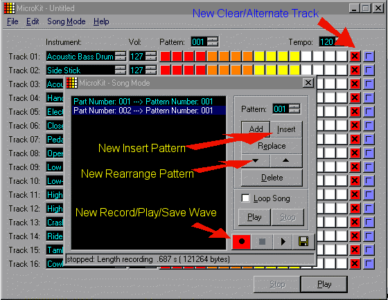

## MicroKit 1\.01 Update : Save song to Wave

### Description

This is an unofficial update to the award winning drum synthetizer MicroKit from Stuart Pennington. I added support to save the songs in Wave format, which can be later converted to MP3. Also added more editing features, like: clear track, alternate track, insert and rearrange patterns in song mode. You may include your own voice while saving to wave if your microphone is turned on.
 
### More Info
 
Saving to wave requires a lot of memory and disk space.

             |
---                |---
**Submitted On**   |2000-09-03 01:23:46
**By**             |[Aldo Vargas](https://github.com/Planet-Source-Code/PSCIndex/blob/master/ByAuthor/aldo-vargas.md)
**Level**          |Advanced
**User Rating**    |4.8 (43 globes from 9 users)
**Compatibility**  |VB 5\.0, VB 6\.0
**Category**       |[Sound/MP3](https://github.com/Planet-Source-Code/PSCIndex/blob/master/ByCategory/sound-mp3__1-45.md)
**World**          |[Visual Basic](https://github.com/Planet-Source-Code/PSCIndex/blob/master/ByWorld/visual-basic.md)
**Archive File**   |[CODE\_UPLOAD9581932000\.zip](https://github.com/Planet-Source-Code/aldo-vargas-microkit-1-01-update-save-song-to-wave__1-11227/archive/master.zip)

